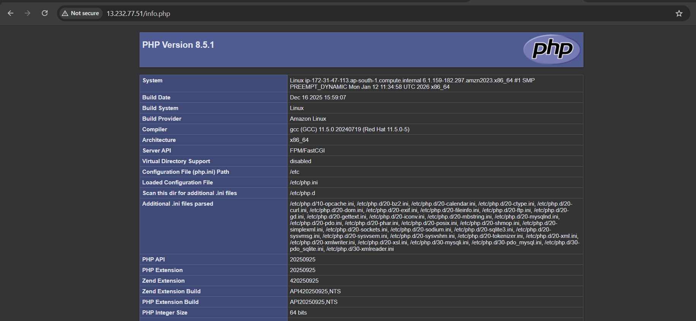

LAMP stack configuration using ansible, before proceeding launch a server in aws and add the public ip-address in the inventory file under [node]
Install package on base machine.
```
sudo yum install ansible-core git -y
```

Clone the Repo
```
git clone "https://github.com/MohitGupta1010/Ansible-LAMP.git"
```

Add below lines in /etc/ansible/ansible.cfg
```
echo -e "[defaults]
inventory = /root/ansible/inventory
host_key_checking = false
remote_user = ec2-user
ask_pass = false
private_key_file = /root/second_exam.pem

[privilege_escalation]
become = true
become_ask_pass = false
become_method = sudo" >>/etc/ansible/ansible.cfg
```

Execute below command to run the playbook 
```
cd Ansible-LAMP/
ansible-playbook playbook.yml --syntax-check
ansible-playbook playbook.yml -v
```
Allow http and https traffic in aws EC2 security group anywhere from ipv4 address.

Access the url by using
```
http://13.232.77.51
http://13.232.77.51/info.php
```




Database is accessible with username root and password root@123
